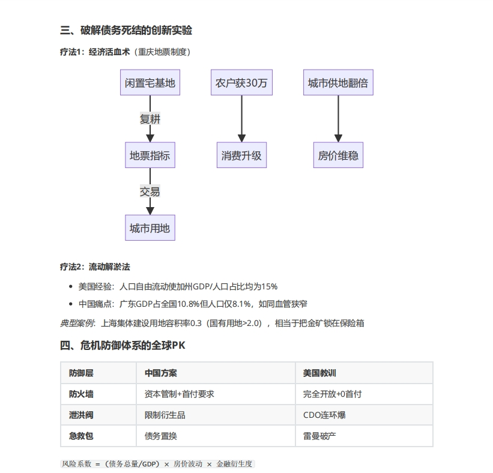
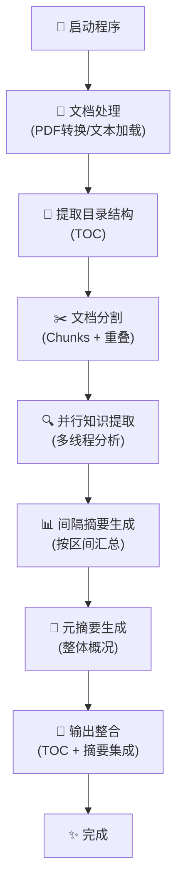

# AI书籍阅读工具

一个强大的AI书籍阅读和分析工具，能够提取文档目录、分析内容、生成摘要和整合输出。


**输出样例**: [置身事内_integrated_detailed_deepseek.pdf](./assets/pdf/置身事内_integrated_detailed_deepseek.pdf)

## 功能特点

- 提取文档目录
- 将文档分割成可管理的chunks
- 分析每个chunk并提取关键信息
- 生成中间摘要和整体摘要
- 整合所有输出为一个完整的阅读报告
- 多线程并行处理，提高效率
- 实时显示处理进度
- 支持多种深度选项，满足不同阅读需求

## 处理流程

工具采用模块化的处理流程，通过以下步骤完成文档分析：



### 详细流程说明

1. **程序初始化**
   - 打印欢迎信息和功能介绍
   - 解析命令行参数（文件路径、分割参数、并行数等）
   - 验证输入文件存在性

2. **环境准备**
   - 初始化大语言模型（LLM）
   - 创建输出目录结构（TOC、知识点、摘要、集成输出等）
   - 根据文件类型配置相应处理器

3. **文档预处理**
   - PDF文件：通过API转换为Markdown格式
   - 其他格式：直接加载文本内容
   - 使用AI提取文档目录结构

4. **文本分析**
   - 将文档按指定大小分割为chunks（支持重叠处理）
   - 多线程并行分析每个chunk，提取关键知识点
   - 实时显示处理进度和耗时统计

5. **摘要生成**
   - 按设定间隔（如每5个chunks）组织知识点
   - 多线程并行生成间隔摘要
   - 基于所有摘要生成元摘要（整体概况）

6. **输出整合**
   - 将目录、间隔摘要和元摘要整合为完整报告
   - 根据选择的分析深度调整内容详细程度
   - 生成最终的Markdown格式报告文件

### 并行处理优化

- **Chunk分析并行化**：使用ThreadPoolExecutor同时处理多个chunks
- **摘要生成并行化**：同时生成多个区间摘要
- **进度监控**：使用tqdm实时显示处理进度
- **错误处理**：单个chunk失败不影响整体处理流程

## 支持的文件格式

- Markdown (.md) 🌟
- 纯文本 (.txt)
- PDF (.pdf) - 自动通过API转换为Markdown

## LLM配置

工具支持多种LLM提供商，通过 `PROVIDER` 环境变量进行选择：

### OpenAI兼容API (推荐)

适用于各种OpenAI兼容的API服务，如SiliconFlow、DeepSeek等：

```env
PROVIDER=openai
OPENAI_BASE_URL=https://api.siliconflow.cn/v1
OPENAI_DEFAULT_MODEL=Pro/deepseek-ai/DeepSeek-V3
OPENAI_API_KEY=your_api_key_here
```

### Azure OpenAI

适用于微软Azure OpenAI服务：

```env
PROVIDER=azure
AZURE_API_BASE=https://your-resource-name.openai.azure.com/
AZURE_API_VERSION=2025-01-01-preview
AZURE_API_KEY=your_azure_api_key_here
```

### 切换提供商

只需修改 `.env` 文件中的 `PROVIDER` 值即可轻松切换：
- `PROVIDER=openai` - 使用OpenAI兼容API
- `PROVIDER=azure` - 使用Azure OpenAI

## 深度选项

工具提供三种不同的分析深度选项：

- **conceptual**：简明扼要，仅聚焦于核心概念和理论要点，适合快速了解文档的关键内容
- **standard**：平衡详细度，包含概念、例子和应用，适合一般阅读需求
- **detailed**：通俗易懂且详尽全面，包含所有例子、故事和应用场景，适合深入学习

## 安装

1. 克隆仓库：

```bash
git clone https://github.com/yourusername/ai-book-reader.git
cd ai-book-reader
```

2. 安装依赖：

```bash
pip install -r requirements.txt
```

3. 创建`.env`文件并配置API

## 使用方法

基本用法：

```bash
python cli.py --file your_book.md
```

高级选项：

```bash
python cli.py --file your_book.md --chunk-size 5000 --overlap 500 --interval 5 --workers 3 --depth standard
```

参数说明：
- `--file`, `-f`: 要分析的文件路径（必填）
- `--chunk-size`: 分割大小（字符数），默认为5000
- `--overlap`: chunk重叠大小（字符数），默认为500
- `--interval`: 摘要生成间隔（chunk数量），默认为5
- `--workers`: 并行处理线程数，默认为3
- `--depth`: 分析深度，可选值为"conceptual"、"standard"、"detailed"，默认为"standard"

PDF处理选项（仅API场景有效）：
- `--enable-formula`: 启用公式识别
- `--enable-table`: 启用表格识别
- `--enable-image-caption`: 启用图片打标
- `--pdf-language`: PDF处理语言，默认为中文(ch)
- `--force-ocr`: 强制使用OCR

## 输出文件

处理完成后，将在以下目录中生成文件：

- `book_analysis/toc/`: 提取的目录
- `book_analysis/knowledge/`: 每个chunk的分析结果
- `book_analysis/summaries/`: 中间摘要
- `book_analysis/meta_summaries/`: 元摘要
- `book_analysis/integrated/`: 整合的最终报告

## 自定义

可以在`config.py`和`prompt.py`文件中修改配置参数和提示词。

## 致谢

本项目受到 [echohive42/AI-reads-books-page-by-page](https://github.com/echohive42/AI-reads-books-page-by-page/tree/main) 项目的启发。该项目提供了一种智能的PDF书籍页面分析方法，通过提取知识点并在指定间隔生成渐进式摘要，为本项目的开发提供了宝贵的参考。特此感谢。
